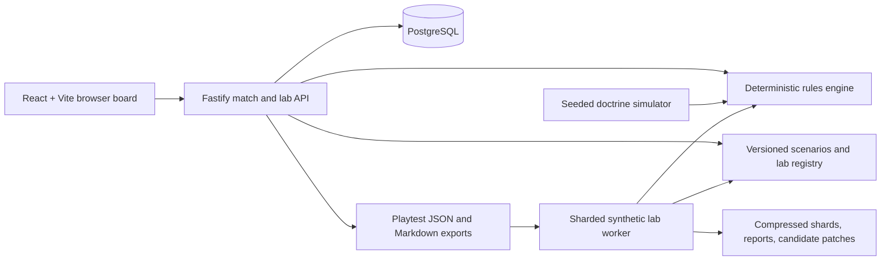

# Context Landscape

[](https://github.com/djcdevelopment/contextlandscape/actions/workflows/mechanics-lab.yml)
[](https://nodejs.org/)
[](https://www.typescriptlang.org/)
[](https://www.docker.com/)

Context Landscape is a research prototype for an AI-orchestration autobattler. The player commands a small force through systems-engineering decisions—scout, establish a contract, implement, review, consolidate, or commit with a full send—while managing energy, heat, dispersion, confidence drift, and incomplete information.

The repository combines a playable browser game with a deterministic simulation and experimentation platform. Its purpose is to discover whether the underlying decisions are legible and interesting before committing to the larger asynchronous PvP and social product.

> **Prototype status:** the baseline game, synthetic balance worker, and blinded single-player gameplay labs are implemented. Content and tuning remain research-grade; synthetic recommendations never promote themselves.

## Table of contents

- [Why this exists](#why-this-exists)
- [Current status](#current-status)
- [Quick start](#quick-start)
- [How to play](#how-to-play)
- [Architecture](#architecture)
- [Research loop](#research-loop)
- [Common commands](#common-commands)
- [Repository layout](#repository-layout)
- [Deployment](#deployment)
- [Documentation](#documentation)
- [Data and security](#data-and-security)
- [Contributing](#contributing)

## Why this exists

The project started from two design documents, both now archived under `docs/archive/`:

- [Original vision — autobattler](docs/archive/original-vision-autobattler.docx) described the product vision, player fantasy, core loop, forces, progression, and social direction.
- [Original vision — Scenario Forge](docs/archive/original-vision-scenario-forge.docx) described the scenario grammar, battlefield structure, pressure systems, and content-generation direction.

> **These are vision documents, not specifications.** They describe weapons, mounts, loadouts, terrain
> types, commander upgrades, mission families, and campaign packs that this codebase does not
> implement, and they predate the current design direction. Read
> [docs/IMPLEMENTED.md](docs/IMPLEMENTED.md) for what actually exists.

This prototype narrows those ideas into a falsifiable question: can systems-engineering tradeoffs become understandable battlefield decisions? The current implementation therefore prioritizes deterministic mechanics, replayable evidence, synthetic search, and short human review labs over accounts, monetization, realtime play, or production art.

## Current status

| Surface | Implemented state |
| --- | --- |
| Playable game | React/Vite 10×10 board, selectable cells, explicit unit orders, transaction console, and post-battle reconstruction |
| Commander landscape | Opt-in sparse Canvas view of a 6,400×6,400 theater with 32×32 chunk LOD and 32×32×32 battle drill-down |
| Scenario pack | Four versioned single-player scenarios with distinct lessons and rules profiles |
| Rules engine | Deterministic TypeScript state transitions, seeded runs, idempotent commands, replay manifests, and event/projection hashes |
| Persistence | PostgreSQL for matches, commands, events, observations, challenges, and gameplay-lab sessions; in-memory mode for portable runtime checks |
| Synthetic research | Seeded doctrine simulator plus a resumable, sharded Docker worker with train/holdout comparisons and recommendation-only candidate patches |
| Broad v2 research | Versioned 6,400-profile doctrine catalog, fold-specific sparse matchup graphs, physical battle-sample catalog, exact sizing envelopes, and a materialized standard sweep plan; full execution is locked pending the campaign runner and post-screen selection lineage |
| Gameplay research | Five blinded lab packs, 24 playable variants, gated pre/post-reconstruction reviews, joined exports, and executable follow-up matrices |
| CI | Typecheck, tests, a bounded mechanics matrix, report generation, and recommendation validation on pushes, pull requests, and a nightly schedule |

The completed `sleep-01` campaign evaluated **19,456,000 deterministic matches**. It found useful policy and tuning boundaries, but also demonstrated that more simulation cannot recover a mechanic the engine does not currently exercise: composition labels do not yet produce valid chassis-balance evidence.

Known boundaries:

- no real population-level balance claim has been made;
- the first human gameplay-lab cycle is still in progress;
- composition needs mechanically distinct loadouts, initiative interactions, or multi-order slots before another large balance campaign;
- the 30,008,992-run standard commander-landscape sweep is planned and content-addressed; a bounded v2 resolver smoke exists, but canonical execution still requires the durable campaign runner and post-screen selection lineage;
- Discord, profiles, matchmaking, ranked play, and durable progression are future product work.

## Quick start

### Requirements

- Git
- Docker Engine or Docker Desktop with the Compose plugin
- PowerShell 7 for the repository scripts
- Node.js 24 or newer for running npm commands directly on the host

Default development ports:

| Service | Address |
| --- | --- |
| Browser UI | <http://localhost:5173> |
| Match API | <http://localhost:9080> |
| PostgreSQL | `127.0.0.1:5442` |

> **Gameplay-lab data prerequisite:** server startup validates the full source reports that produced each gameplay experiment. Those large generated reports are intentionally excluded from Git. They are already present in the OMEN research checkout; a new machine must restore the `sleep-01` report artifacts under `data/lab/` or regenerate them before starting the server. See [Gameplay-lab dataset](#gameplay-lab-dataset) below.

A fresh clone can run `npm ci`, build, typecheck, and test without those reports; only server startup and gameplay-lab preflight require them.

### Start the development stack

```powershell
git clone https://github.com/djcdevelopment/contextlandscape.git
Set-Location contextlandscape
docker compose -p context-landscape-dev -f infra/compose.dev.yml up --build -d
docker compose -p context-landscape-dev -f infra/compose.dev.yml ps
Invoke-RestMethod http://127.0.0.1:9080/health/ready
```

Open <http://localhost:5173>. The opt-in commander vertical slice is at
<http://localhost:5173/?view=commander>; it uses the live sparse landscape API when available and a
deterministic sparse fixture otherwise. A healthy development response reports:

```text
status      : ok
persistence : postgres
```

Follow logs:

```powershell
docker compose -p context-landscape-dev -f infra/compose.dev.yml logs -f app web
```

Stop the stack while preserving its PostgreSQL volume:

```powershell
docker compose -p context-landscape-dev -f infra/compose.dev.yml down
```

### Gameplay-lab dataset

To regenerate the complete source campaign:

```powershell
docker compose -p context-landscape-lab -f infra/compose.lab.yml build worker
.\scripts\lab-sleep.ps1 -CampaignId sleep-01 -Shards 12 -DryRun
.\scripts\lab-sleep.ps1 -CampaignId sleep-01 -Shards 12 -MinimumFreeGiB 50
```

The dry run prints the matrix and storage plan without launching it. See [OVERNIGHT_EXPERIMENT_PLAN.md](OVERNIGHT_EXPERIMENT_PLAN.md) before running the full campaign.

## How to play

### Normal scenarios

1. Choose a scenario.
2. Select any battlefield cell to inspect its compact JSON representation.
3. Select a friendly unit to enable its command actions.
4. Issue one bounded order per slot and watch the transaction console.
5. Reach the mission threshold without exhausting the relevant energy, heat, or context constraints.
6. Use the post-battle reconstruction to understand the causal sequence.

Start with **The Two Baked Slices** and use [PLAYTEST_WORKBOOK.md](PLAYTEST_WORKBOOK.md) if you want the intended verification route.

### Blinded gameplay labs

Select **Gameplay labs** to open GL-001 through GL-005. Trials use anonymous labels so their treatment and synthetic recommendation remain hidden.

- Play until the battlefield reaches `victory` or `defeat`.
- **Bookmark note (does not advance)** records a meaningful decision without finishing the trial.
- Select **Complete trial**, explain the result before reconstruction, then review it again afterward.
- Complete every anonymous trial before comparing and revealing treatments.
- Use **Leave lab** if you need to return to the catalog; partial evidence remains server-side.

The full operator procedure is in [GAMEPLAY_LAB_WORKBOOK.md](GAMEPLAY_LAB_WORKBOOK.md).

## Architecture



The important boundaries are deliberate:

- `packages/contracts` owns shared schemas and transport contracts.
- `packages/engine` owns deterministic gameplay truth.
- `packages/scenarios` owns versioned content, rules profiles, and gameplay-lab definitions.
- `apps/server` owns persistence, hidden treatment mapping, API blinding, review gates, and exports.
- `apps/simulator` compares named doctrines quickly.
- `apps/lab` runs large reproducible matrices and bounded human-selected follow-ups.
- `apps/web` renders the board and research workflow without owning hidden treatment data.

Every deployable path uses a Linux container. OMEN is the development and current runtime host; the same immutable image can move to AM4 or GCP without rebuilding.

## Research loop

Synthetic simulation is a hypothesis generator, not a replacement for play:

```text
seeded simulation
  -> sharded train/holdout matrix
  -> explicit edge and falsifier
  -> versioned blinded gameplay lab
  -> player explanation before reconstruction
  -> keep / revise / reject
  -> bounded control-versus-treatment follow-up
  -> manual scenario-version decision
```

The server performs a startup preflight before exposing the gameplay-lab catalog. It checks source provenance, scenario versions, variant reachability, winning-path evidence, and exact replay equality for control variants.

Selected `sleep-01` views:

- [Train/holdout replication](data/lab/sleep-01-analysis/01-holdout-replication.svg)
- [Policy desert and dominance](data/lab/sleep-01-analysis/02-policy-desert.svg)
- [Pressure coverage and the energy cliff](data/lab/sleep-01-analysis/03-pressure-coverage.svg)
- [Machine-readable campaign summary](data/lab/sleep-01-summary.json)

See [R_AND_D_LAB.md](R_AND_D_LAB.md) for the evidence model and [GAMEPLAY_LAB_RETROSPECTIVE.md](GAMEPLAY_LAB_RETROSPECTIVE.md) for what the first cycle taught us.

## Common commands

### Build and verify

```powershell
npm ci
npm run build
npm run typecheck
npm test
```

### Acceptance seams

With the development stack running:

```powershell
.\scripts\smoke.ps1
.\scripts\research-smoke.ps1
.\scripts\gameplay-lab-smoke.ps1
npm run gameplay-lab:preflight
```

### Seeded simulation

```powershell
npm run simulate -- --count=100
npm run simulate -- --scenario=false-bottleneck --count=1000
```

### Small synthetic matrix

```powershell
npm run build
npm run lab -- --matrix=local-check --runs=25 --policies=12 --shards=1 --shard=0
npm run lab -- --report=data/lab/local-check
.\scripts\lab-gate.ps1 -ReportPath data/lab/local-check/report.json -MinimumRuns 25
```

New matrices seal the Git/build identity, model/scenario/policy hashes, and manifest hash into every shard and report. Add `--canonical=true` to reject dirty or unidentified source, then audit or compare completed evidence:

```powershell
npm run lab -- --audit=data/lab/local-check
npm run lab -- --left=data/lab/train-01 --right=data/lab/holdout-01
npm run lab -- --record=data/lab/train-01 --stage=train --hypothesis="Describe the tested edge"
```

The last command explicitly promotes a reviewed canonical result into `data/experiments/ledger.json` and archives its sealed manifest, compact report, and recommendations under `data/experiments/<matrix-id>/`; raw shards remain untracked and disposable. Legacy v1 matrices remain readable but are reported as historically unverifiable.

### Attention-command matrix

The versioned `duel-capacity-v1` model runs two-player, common-random-world counterfactuals for movement, stationary chassis effects, the shared capacity track, and scale-scope abilities. Inspect the frozen campaign sizes without writing artifacts:

```powershell
npm run lab -- --attention-campaign=stationary-train --dry-run=true
npm run lab -- --attention-campaign=capacity-train --dry-run=true
npm run lab -- --attention-campaign=holdout --dry-run=true
```

For the canonical 480,000-run stationary screen, 144,000-run capacity screen, and independent 50,000-run holdout, use one pinned Docker build across all shards:

```powershell
.\scripts\lab-attention.ps1 -Canonical
```

Each run stores the manifest/provenance link, policy-independent random-stream ID, terminal outcome, SHA state/outcome hashes, and bounded summary counters. The compact report adds paired confidence intervals, interaction effects, acceptance gates, shard hashes, and a self-hash; `--audit`, `--left/--right`, and `--record` work for both legacy and attention matrices.

The completed 674,000-run v1r1 campaign accepted the Scout, Siege, movement, and stationary escort behaviors as the research baseline. Macro Flare remained useful but failed its predeclared causal drift-defeat gate, so its tuning is still experimental. See the immutable evidence and next-experiment pre-registration in the [v1r1 research decision](design/attention-duel-v1r1-decision.md).

### Sharded Docker matrix

```powershell
.\scripts\lab-night.ps1 -MatrixId overnight-01 -Runs 1000 -Policies 32 -Tunings 6 -Shards 8 -Canonical
```

### Human-selected follow-up

After a completed gameplay-lab session emits `follow-up-matrix.json`:

```powershell
$manifest = "data/playtests/GL-001/<lab-session-id>/follow-up-matrix.json"
npm run lab -- --manifest=$manifest --all-shards=true
```

No command automatically promotes a candidate tuning into a scenario.

## Repository layout

```text
.
├── apps/
│   ├── lab/                 # sharded synthetic matrix worker and reducer
│   ├── server/              # Fastify API, persistence, lab sessions, exports
│   ├── simulator/           # quick seeded doctrine comparisons
│   └── web/                 # React/Vite battlefield and lab UI
├── packages/
│   ├── contracts/           # shared Zod schemas and TypeScript contracts
│   ├── discord-adapter/     # future transport seam
│   ├── engine/              # deterministic rules, replay, reconstruction
│   └── scenarios/           # scenario pack and gameplay-lab registry
├── infra/
│   ├── compose.dev.yml      # OMEN development stack
│   ├── compose.lab.yml      # portable private worker
│   └── compose.release.yml  # immutable production runtime
├── scripts/                 # build, smoke, lab, retention, and promotion tools
├── data/lab/                # generated research artifacts; mostly gitignored
├── docs/
│   ├── IMPLEMENTED.md       # what actually exists, versus the archived vision
│   └── archive/             # superseded original design documents
├── Dockerfile               # dev, verification, lab, and runtime stages
└── *.md                     # research, operations, and review docs
```

## Deployment

The current baseline is deployed behind a private Tailscale network and is not publicly reachable; its address lives in the untracked `.env.omen` rather than in this repository.

As of 2026-07-29, that route serves release `p0-rd-20260729-r5`. The newer gameplay-lab build is verified on OMEN but has not yet been promoted with the required AM4 Caddy allowlist changes, so the lab API families are not part of the current acceptance claim.

> **Route rename:** the served path changed from `/mech/` to `/landscape/`. The AM4 Caddy allowlist still matches the old path, so ingress must be updated in the same release window or the deployment will 404.

Release properties:

- build and verify once;
- tag with an explicit release ID;
- transfer the immutable OCI image;
- start remotely with `--no-build`;
- validate application health and AM4 ingress independently;
- retain both PostgreSQL and playtest-export data during rollback.

Use [DEPLOYMENT_RUNBOOK.md](DEPLOYMENT_RUNBOOK.md) for release promotion, public smoke checks, ingress validation, persistence checks, and rollback.

## Documentation

### What is actually built

- [Implemented surface](docs/IMPLEMENTED.md)

### Archived vision sources

- [Original vision — autobattler](docs/archive/original-vision-autobattler.docx)
- [Original vision — Scenario Forge](docs/archive/original-vision-scenario-forge.docx)

### Player and operator guides

- [First-time playtest workbook](PLAYTEST_WORKBOOK.md)
- [Gameplay-lab operator workbook](GAMEPLAY_LAB_WORKBOOK.md)
- [Deployment runbook](DEPLOYMENT_RUNBOOK.md)

### Research and implementation

- [Context Landscape R&D lab](R_AND_D_LAB.md)
- [Overnight experiment plan and outcome](OVERNIGHT_EXPERIMENT_PLAN.md)
- [Synthetic-to-gameplay lab plan](GAMEPLAY_LAB_PLAN.md)
- [Gameplay-lab implementation retrospective](GAMEPLAY_LAB_RETROSPECTIVE.md)
- [Attempt-bank pilot retrospective](BANK_PILOT_RETROSPECTIVE.md)

## Data and security

- `.env.omen`, `.env`, runtime databases, generated playtests, raw shards, and browser profiles are ignored by Git.
- `.env.example` contains development placeholders only.
- Raw synthetic runs belong under `data/lab/`; completed human sessions belong under `data/playtests/`.
- Only the compact `sleep-01` summary and three curated SVG analyses are tracked.
- Public ingress uses an explicit route allowlist. A healthy container does not by itself prove that a public feature is reachable.
- Do not commit deployment credentials, PostgreSQL volumes, participant exports, or unreviewed raw telemetry.

## Contributing

This is still an R&D repository, so a useful change should state which player or research question it answers.

Before opening a pull request:

1. Keep engine changes deterministic and add a focused test.
2. Version scenario or lab contract changes explicitly.
3. Run `npm run typecheck` and `npm test`.
4. Run the relevant smoke script for API, persistence, or workflow changes.
5. Update the appropriate workbook or runbook when operator behavior changes.
6. Treat synthetic recommendations as evidence requiring review, not as automatic balance decisions.

The `mechanics-lab` GitHub workflow repeats the core checks and runs a bounded matrix on pull requests and pushes to `main`.
