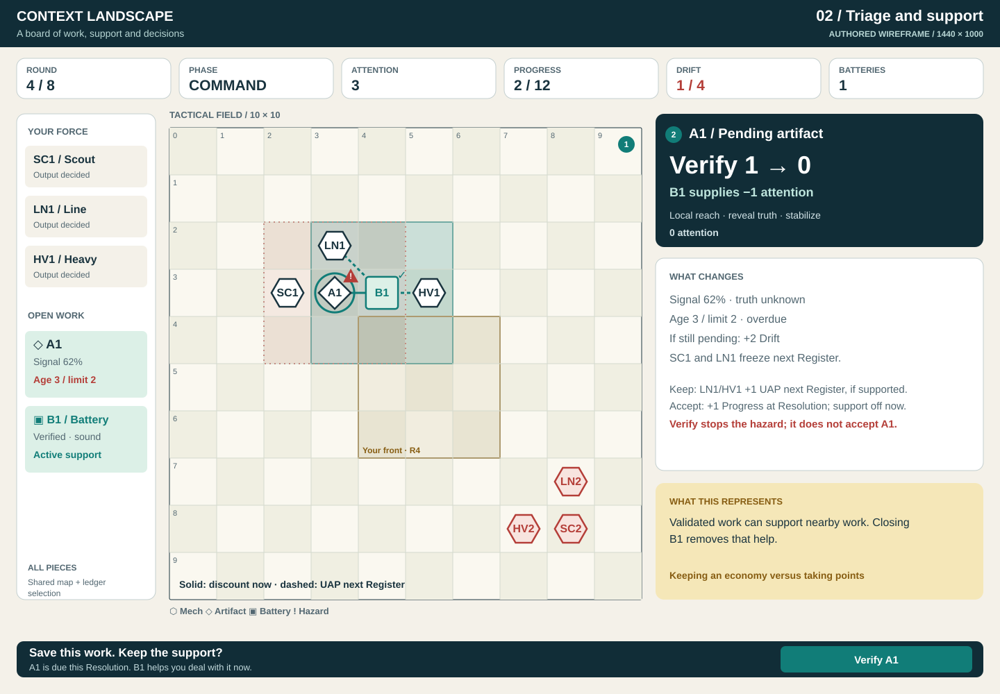

# Board brief: make the balancing act visible

**Decision:** use a 2D tabletop board as the primary decision surface. Give artifacts and batteries identities, selection behavior and spatial influence comparable to mechs. Keep precise tradeoffs visible when choosing an action, and offer the work analogy alongside the decision.

This is an illustrated specification for `attention-economy-v4.4`, including the user-directed rules that range shifts cost one UAP per step without a calibration penalty and Smoke affects only mechs. Batteries keep working inside Smoke. The board redesign remains a design artifact. Read the [ontology and impact map](ontology-and-impact.md) for rules and [reference patterns](reference-patterns.md) for sources. Open the [wireframe gallery](index.html) to compare the four scenes at three viewport sizes.

## Intended experience

“I can create more work than I can safely finish. I need to choose what to trust, what to inspect, what to preserve as support, and what to close before I lose my room to react.”

Success means a friend can form a plan, understand the consequence, and recognize a familiar gaming skill in the work analogy. They do not need to learn software terminology to operate the game. Visible teaching is short, concrete and collapsible; it does not interrupt every action.

The chosen scope is desktop first, mobile adapted; key numbers plus previews; existing mechanics; both player-consequence and developer-change mapping. The default board is 2D, with Perspective retained as a secondary presentation in a future implementation.

## Information hierarchy

### The shared tabletop

The board occupies the largest stable square in the desktop layout. A compact status row holds Round, phase/actor, attention, Progress and Drift. A narrow left ledger identifies mechs and open work; a right inspector explains the selected piece/action. The bottom contains a concise preview and phase submission controls. Selecting an artifact does not reserve a competing full mech editor beneath the board.

In the 1440×1000 drawing, a 680px square field sits between a 200px ledger and a 472px inspector. The 2048×900 drawing uses a 620px field, a 250px ledger and a wider explanation region; spare width becomes useful cost/recipient detail rather than empty battlefield margins. These are illustrative spatial budgets, not a mandate to scale text down to force a fixed viewport.

At 390×844 the status, selected-piece summary, 340px board and current action fit in the illustrated viewport. Detailed math and teaching use a labeled expandable sheet below the compact action summary. All of the same entities remain accessible through the ledger/stack chooser. The phone board is an overview: zoom or the list provides comfortable selection targets for crowded cells.

The gallery labels every scene as an authored design fixture. Numbers are tied to checked examples, but the layouts do not claim a replay of one complete naturally reached match. Desktop side notes explain conditions; mobile illustrations show the default collapsed detail state.

### Piece identities and consistent selection

| Piece or field | Persistent representation | Selected representation |
| --- | --- | --- |
| Mech | Hexagonal counter, chassis abbreviation and ID, owner border, UAP pips | Ordered plan, reach footprint and relevant source/recipient connections; portrait belongs in the inspector |
| Pending artifact | Diamond counter with short ID; confidence signal in the ledger; visible urgency marker | Signal, density, generation calibration, age/limit, objective eligibility and legal interventions |
| Verified artifact | Diamond plus check and revealed truth label | Stable status; distinguish keeping it pending from completing it |
| Battery | Square infrastructure counter with B ID and verified mark, matching the underlying artifact's stable identity | 3×3 field, recipient links and “discount now / UAP at Register”; a battery label supplements its artifact identity |
| Battery inside Smoke | Normal active square and field; recipient links remain | Discounts continue now and mech assistance still applies at the next Register |
| Hazard | Triangle with explicit deadline and affected count | Exact reasons, +2 Drift if unresolved, named nearby friendly mechs that freeze |
| Objective front | Outline plus owner/round label | Existing artifact eligibility badge remains tied to birth, even after the front moves |
| Staged change | Dashed destination/field; numbered steps | Solid current state and dashed proposed state; all persistent plans remain visible after selection changes |

Color reinforces the symbols. Text and border patterns carry the same distinctions. Shapes never imply a new unit class or independent battery health.

Click/tap or keyboard selection sets one domain selection, shared by board, ledger and inspector. On a cell with multiple pieces, open a small list of **all** pieces, ordered by current hazard, selected identity, then stable ID; selecting a row picks that identity. Do not silently choose the mech or first artifact. Escape returns to the cell, retaining keyboard focus. The mobile ledger provides the same list without requiring precise taps on 34px cells.

## One action grammar

Every action uses these fields, in this order:

**Action → cost → timing → reach/target → affected objects → consequence → condition.**

The preview is tied to the current match revision, phase, actor and staged intent. It updates during selection and clears when the authoritative revision changes. It must not remain actionable after a friend submits or the turn changes.

### Numeric and uncertainty conventions

| Convention | Example |
| --- | --- |
| Name the metric; use percentage points for an absolute percentage difference | “Step-Up: effective calibration 48% → 68% · +20 pp” |
| Keep density fixed when comparing calibration plans, or label both changed inputs | “At 80% density; for newly emitted artifacts” |
| Show the underlying cause | “Line range 3 → 4 costs 1 UAP; calibration stays at 60%” |
| Show conditional alternatives without recommending a solved move | “Range shift + Step-Up: 85% calibration; effective 68% at 80% density; uses both UAP” |
| Separate information from improvement | “Verify reveals truth and stabilizes this artifact.” It does not raise its underlying soundness. |
| Distinguish confidence signal from a probability | “Confidence signal 62% · truth unknown.” Never “62% chance this will succeed” from that field alone. |
| Show integer budgets as integers | “Verify 1 − Battery B1 1 = 0 attention”; “2/2 UAP staged” |
| Name when the effect happens | “Discount ends now”; “+1 Progress at Resolution if eligible”; “+1 UAP at next Register if still supported” |
| State uncertainty at the point of choice | “Assuming this plan resolves”; “enemy may place Chaff in this salvo”; “soundness not yet revealed” |

“Range” is action-specific. Spawn coverage excludes the emitter cell and uses Chebyshev distance. Local Verify reaches one cell from any owned mech; Support Scan supplies a separate attached route. Seize has no range restriction. Artillery can target any in-bounds center and affects a 3×3 footprint.

### Data required by each visible element

| Display | Existing authoritative input | What is still needed for implementation |
| --- | --- | --- |
| Piece identity, source and status | `projection.units/artifacts` and viewer identity | Shared stack selection and stable short labels |
| Budgets and affordability | `legal.kinetic`, `legal.allocations`, `legal.artifacts.*.cost`, `legal.capacity` | Explain costs; do not recalculate legality from button labels |
| Actual current discounts | Cost breakdown including `batteryArtifactId` | Recipient links and ownership-aware explanation |
| Current hazard and frozen recipients | `legal.projectedHazards` | Use this projection; stale `overTaxReasons` alone is insufficient |
| Existing artillery footprint targets | `legal.artilleryPreviews` and zones | Quantitative Smoke/EMP/Flare effect explanation, expiry and conditional same-salvo outcome |
| Staged Kinetic consequences | Draft plans plus current public state/rules | Engine-owned, viewer-safe preview of the complete ordered plan, including constraints and conditional conflicts; current legal projection is insufficient |
| Alternative battery commitment | Current artifact, recipient costs, current positions and phase | Authoritative “with / without this battery” effects; mark next-Register benefits conditional |
| Resolution story | `recaps.resolution`, `recaps.register`, before/after views and public events | Timestamped causal assembly; preserve current-state accuracy across reloads and friend updates |

The board redesign adds no public API fields or endpoints. The range-cost amendment changes ruleset/resolver identity; the proposed consequence projections remain future work. A later implementation should extend authoritative read-only effect projections where these gaps require it. It must not copy the complete reducer into React, reveal hidden values, or predict seeded output by simulating undisclosed state.

## Four annotated scenes

The SVGs show information placement, piece grammar and example copy. They are static wireframes, not interactive match clients. The gallery can switch scenes/viewports; action-looking elements inside the SVG do not submit anything.

| Scene / question | Concrete content | Map and pattern links |
| --- | --- | --- |
| **S01 — Choose your actions.** “How will you spend two actions?” | Move costs 1 UAP and range 3→4 costs 1 UAP. At 80% density, Line calibration stays at 60% and effective calibration at 48%. Range + Step-Up also costs two actions and yields 68% effective calibration (+20 pp); Move + Step-Up keeps range 3. Any pair can be ordered either way. All three require a third UAP, such as a Register battery bonus. Existing artifacts keep their birth metrics. | K01/K03/K05, W05, G01; P02/P10/P11 |
| **S02 — Triage and preserve support.** “Which work needs me, and what is helping?” | A1 is an older pending unverified Line artifact at age 3 / limit 2. B1 is a verified sound, objective-eligible battery at density 80% and source calibration 85%. A1 is locally reachable and receives B1's Verify discount: 1→0 attention. Verifying A1 removes its projected +2 Drift. Preserving B1 keeps current discounts and conditional next-Register help. | D03/D04, T06/T07, W03/W04/W06; P03/P04/P08 |
| **S03 — Respond to interference.** “What does Smoke actually change?” | A Smoke center covers a prepared Line (85%), a Heavy (90%), and B1. Current mech calibration resets to 20%; with 80% density the Line's **new output** goes 68→16% effective calibration, −52 pp. B1 stays active: A1's Verify still costs 0 and in-range owned mechs retain +1 UAP at the next Register. Old artifact birth metrics stay fixed. Preview is conditional on the shot not being screened. | A02/A05, G01/G03, W05/W07; P09/P10/P11 |
| **S04 — Read the outcome.** “Why am I better or worse off?” | Example sequence: Verify A1 while B1 still helps, then Accept B1, then finish Command. A1 remains stabilized; B1 supplies +1 Progress at Resolution and is removed. Its discount ended at Accept, and it supplies no next-Register UAP. Show history and current state separately, followed by an optional skill connection. | D03/D04/D09, T08/T11, W06; P01/P02 |

### Controls and edge behavior

- **Kinetic:** staged plans are reversible locally before submission. Current position, numbered moves, tentative reach and calibration changes remain distinguishable. The unit budget applies to the entire ordered plan. Conflicting opponent orders can change the result.
- **Capacity:** within the Command stage, explicitly label “Capacity decision” and its current cost, future award and priority. Only after the server enters Command should Emit/Verify controls become active.
- **Command:** display every owned mech's Emit/Hold decision. Hold is an intentional option. Mark remaining undecided units before End Command. Accept/Reject/Seize/Verify/Focus each consume a command opportunity even when attention cost is zero.
- **Artillery:** show shared Capacity progress while locked, the next Register once activation is scheduled, and hands/cooldowns after activation. Rank 3 is a deliberate escalation: the claimant pays Attention, but both fleets gain artillery. Explain before firing that an ordinary shot grants the opponent one next-salvo cooldown bypass; a shot using that bypass does not chain another privilege. Include all affected owners and known Chaff screen centers. Pending verified artifacts are not HE targets; a Focus guarantee alone does not make an unverified artifact immune.
- **End/Resolution:** confirmation lists current conditional hazards, not just their count. A reconnect can show the next Kinetic state directly; the historical recap is available without pretending the server waits for Continue.
- **Input:** key operations work by keyboard and touch. Hover may reveal a preview, but selection pins it and focus exposes the same content. An unavailable action explains why. Selection never commits a server action.

## Visible workflow connection

At first entry, a short collapsible panel says:

> Your force can produce more work than you can personally inspect. Decide what to trust, what to stabilize, and what to keep as support. This models the balancing act of directing generative tools with limited attention.

The “What this represents” section is available in the inspector and remembered locally if collapsed in the eventual UI. It is initially expanded in onboarding and offered compactly during play. Its content follows the selected decision:

| Selected decision | Brief explanation | Familiar gaming skill |
| --- | --- | --- |
| Output / Hold | “Starting more work can leave more to finish later. Hold keeps the current workload smaller.” | Production planning and reserves |
| Range / Step-Up | “Each action buys movement, reach or preparation. Choose what helps this turn.” | Positioning versus setup |
| Verify | “Spend attention to find out what you have and keep it from becoming a hazard.” | Scouting and information value |
| Keep / commit battery | “Validated work can support nearby work. Closing this piece trades that support for an outcome.” | Maintaining an economy versus taking points |
| Smoke | “Interruption changes the next batch. Work you already validated keeps helping.” | Protecting producers and relying on established support |
| Resolution | “Your choices changed both today's result and what you can afford next.” | Sequencing and planning ahead |

An adjacent “Where the analogy differs” link opens W/G entries in plain language: real context limits are not measured here, bigger mechs do not have better base truth rates, and real completed work can still be reusable. Avoid claiming the game diagnoses skill, productivity or model competence.

## Playtest protocol

Prepare a 15–20 minute walkthrough for five friends who play strategy games but have not learned this game. Begin with the brief onboarding text and the board legend. Let them inspect and explain without coaching. These are formative targets, not a statistically representative experiment.

Use the gallery or printed SVGs for the first pass. Static scenes assess reading and reasoning; interaction speed and gameplay learning require a later working prototype. Do not score a static participant for inability to click an illustrated action.

| Task | Prompt to read aloud | Evidence of comprehension |
| --- | --- | --- |
| PT01 Urgency | “Which artifact needs attention before the round ends, and what happens if you leave it?” | Names A1, the age/limit condition, +2 Drift and affected nearby friendly mechs; distinguishes at-limit from over-limit |
| PT02 Tradeoff | “You have two actions. How could you combine movement, extra range and Step-Up?” | Names the 1-UAP costs, range's unchanged 48% effective calibration, Step-Up's 68% at the same density, and the need to choose two unless a third UAP is available |
| PT03 Support | “What is B1 doing for you? What would change if you accepted it now?” | Names immediate discount loss, conditional next-Register UAP loss and objective-eligible Progress at Resolution |
| PT04 Output budget | “You can emit more work or hold. With the attention and support shown, which would you choose and why?” | Offers a coherent workload/risk argument, recognizes output does not consume attention and unknown births limit exact supervision forecasts; either choice can be justified |
| PT05 Outcome and connection | “Explain this recap. Which decision mattered, and does it resemble a skill you use in another game?” | Connects Verify-before-Accept sequence to stabilization/cost and support loss; names a familiar skill in their own words |

Record each task as **2 = correct unaided; 1 = correct after one neutral clarification; 0 = incorrect/needs teaching**. Keep the participant's first explanation, the misleading label or location, and whether the problem was rules, presentation or analogy. Record when they use the explanation panel; recognition prompted by it is different from spontaneous recognition.

Initial acceptance target: at least four of five participants score 2 on each of PT01–PT03; at least four explain a coherent PT04 tradeoff and a causal PT05 recap; record self-recognition separately rather than forcing it to pass. Any systematic confidence-as-probability or Focus-as-Verify misunderstanding triggers a copy/design revision. These targets are pending human evidence.

Copyable score sheet:

| Participant code | Prior game familiarity | PT01 | PT02 | PT03 | PT04 | PT05 | Explanation panel used? | First confusion / exact words | Skill recognized, spontaneous or prompted? |
| --- | --- | --- | --- | --- | --- | --- | --- | --- | --- |
| | | | | | | | | | |

Do not equate winning with understanding. The current Drift-heavy baseline can obscure the Progress tradeoff; record when the scenario failed to produce a meaningful choice. No recruitment messages, telemetry changes or human playtests have been performed by creating this package.

## Acceptance and handoff

The design package is complete when the map covers the current action unions and automatic transitions; references distinguish observations from our inference; all four scenes exist at all three sizes; diagrams have meaningful titles/descriptions; links resolve; and numerical/knowledge-boundary examples pass the source reducer checks.

Rebuild figures with `node design/board-design/render-wireframes.mjs`. Check mechanics with `node --import tsx design/board-design/check-examples.mjs` and package links/figures with `node design/board-design/check-package.mjs`. The scripts live only with this design artifact.

Future implementation should start with a single S02 slice: selection, stack access, battery recipients and Verify/commit explanation. Add S01/S03 exact previews only after filling their authoritative projection gaps. Then exercise friend waiting/revision transitions, keyboard/touch behavior, zoom and interface-scale layouts, and the PT protocol. Rule experiments, a new ontology runtime and a deployed redesign are separate work.
