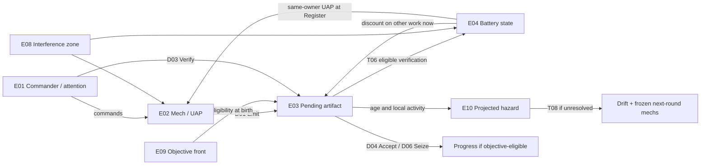
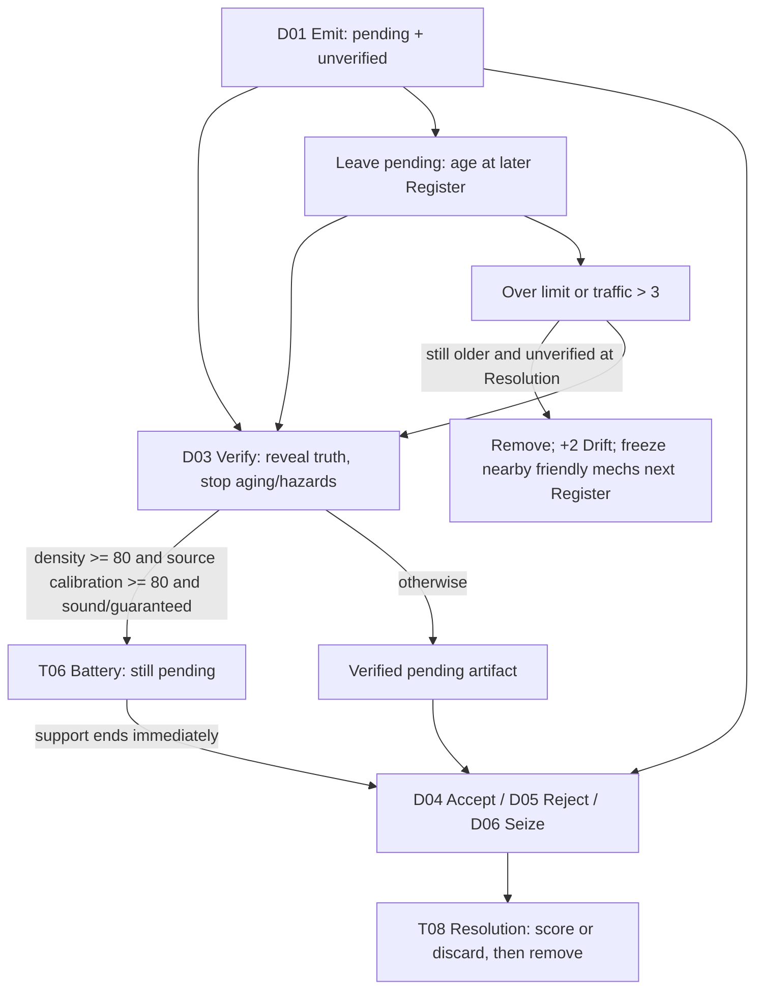
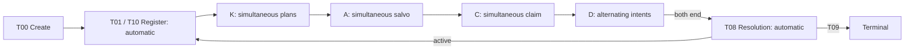

# Board ontology and impact map

This map connects the decisions a player makes, the workflow they represent, and the code that governs them. Read it before changing a board control or a rule. The companion [design brief](board-brief.md) assigns those decisions a visible form; the [reference study](reference-patterns.md) explains the design patterns.

**Base source:** `c714a1903da52c181820bc0f4004411c4d78055c` plus the user-directed range-cost and mech-only Smoke amendments of 2026-09-06. Ruleset `attention-economy-v4.4`; resolver `attention-v4.4-resolver-1`; state/view schema 3. The external model ID remains `duel-capacity-v3-experimental` and is insufficient to identify the rules. One UAP per ±1 step is the range cost, without a calibration penalty. Smoke disrupts mechs while batteries retain their support. The [example report](example-results.json) fingerprints the reviewed source files.

The subsequent UI clarification adds underlined UAP/Battery/Condense/Range/Step-Up/Scan help, per-step cancellation with local point refunds, and viewport sizing based on actual controls. General UAP help lives on the side-navigation term; roster cards carry the unit statistics without opening help or repeating them in a selected-unit heading. Range help counts spawn cells from the staged location and explains its action cost and unchanged calibration. Step-Up explains calibration, D×C and conditional battery eligibility; Scan explains staged reach, reservation limits and later remote verification. Cancellation preserves independent steps and identifies invalidated movement/range/scan dependencies before removing them. These are edits to unsubmitted plans, not new engine actions. The Condense preview reads the public rule table and is conditional on resolution without Smoke; it does not fill the complete authoritative preview gap G01.

## Reading the map

- **E** identifies an entity, **K/A/C/D** an action, **T** an automatic transition, **W** a workflow association, **G** a gap, and **P** a reference pattern.
- **Implemented** means traced to the current reducer or projection. **Proposed** means a design requirement. **Analogy** means an interpretation of Derek's described workflow, not a measurement of real models.
- Source references below name files and symbols. Use symbol searches when line numbers move. Effect IDs remain stable across document edits; record a new source cut after rules change.

### Source and consumer index

| ID | Source | Responsibility and useful symbols |
| --- | --- | --- |
| S1 | [v4 contracts](../../packages/contracts/src/attention-v4.ts) | `AttentionV4*StateSchema`, action unions, `AttentionV4LegalSchema`, `AttentionV4RulesSchema`, `BattleCommandV3ViewSchema` aliases. Shape, limits and public interfaces. |
| S2 | [v4 reducer](../../packages/engine/src/attention-v4.ts) | `defaultAttentionV4Rules`, `resolveAttentionV4Kinetic/Artillery/Capacity/Round`, `applyAttentionV4Command`, `projectAttentionV4Match/Hazards`, `legalAttentionV4Actions`. Authoritative effects. |
| S3 | [server bridge](../../apps/server/src/battle-command-core.ts) | `projectBattleCommand`, `submitBattleCommand`, friend pair/intent submission, `publicEvent`, snapshot metadata, retired rules detection. |
| S4 | [board application](../../apps/web/src/battle/BattleCommandApp.tsx) | `BattleCommandApp`, `Board`, `UnitRoster`, `ArtifactTray`, `ArtifactPanel`, `PhaseDock`, `resolutionSurface`. Current presentation and local staging. |
| S5 | [perspective renderer](../../apps/web/src/battle/PerspectiveBoard.tsx) | `PerspectiveBoard`. A second renderer of the same domain; changes must preserve interpretation across views. |
| S6 | [commander compiler](../../packages/engine/src/attention-v4-commander.ts), [controller](../../packages/engine/src/attention-v4-controller.ts) | Versioned compositions/programs, content hashes, automated policies; potential consumers of rules changes. |
| S7 | [engine tests](../../packages/engine/src/attention-v4.test.ts), [conformance tests](../../packages/engine/src/attention-v4-conformance.test.ts) | Existing behavior witnesses: D×C, Condense, Support Scans, Batteries, traffic, Chaff, compiler and conformance. |
| S8 | [board tests](../../apps/web/src/battle/BattleCommandApp.test.tsx), [browser journeys](../../apps/web/e2e/attention-v4-journey.spec.ts), [layout tests](../../apps/web/e2e/battle-command-deck.spec.ts) | Interaction, visibility, presentation of atomic resolution, layout and input behavior. |
| S9 | [API entrypoint](../../apps/server/src/main.ts), [human release](../../apps/server/src/human-release.ts), [friend contracts](../../packages/contracts/src/human-release.ts) | HTTP validation, revisions, persistence, viewer identity, friend submission buffering, event stream and concession. |
| S10 | [implemented boundary](../../docs/IMPLEMENTED.md), [next-work evidence](../../docs/NEXT_WORK_PLAN.md) | Distinguish this game from legacy scenarios, research prototypes and unimplemented vision. |

## Entities: what a piece actually means

| ID / entity | Identity and owned state | Relationships and player consequence | Authority |
| --- | --- | --- | --- |
| E01 Commander/player | `playerId`; attention, capacity bonus, Progress, Drift, ability uses and armory | Chooses which work to generate and supervise. Attention is shared across that player's artifacts. Separate from mech UAP. | S1 player schema; S2 `playerOf`, `performRegister` |
| E02 Mech | `unitId`; owner, chassis, coordinate, range, calibration, reactor, UAP, output decision | Produces artifacts; positioning determines spawn reach and local verification. Kinetic specialization changes future output and support. | S1 unit schema; S2 `validatePlan` |
| E03 Artifact | `artifactId`; owner, source mech/chassis, coordinate, density, generation calibration, reported confidence, age, Context Limit, traffic | A persistent piece of work. May be unverified, verified, guaranteed, staged for resolution, or removed. Confidence is a signal; hidden soundness is a separate value. | S1 artifact/projected-artifact schemas; S2 Command |
| E04 Battery | The same artifact ID with `battery.active`; `suppressed` is a retained schema field with no current gameplay cause | Verified pending work becomes infrastructure when eligible. Its field helps other artifacts now and same-owner mechs at Register, including inside Smoke. Closing the artifact removes that support. | S2 `batteryEligible`, `activeBatteryForArtifact`, `performRegister` |
| E05 Attention and UAP | Integer budgets on E01 and E02 | Attention buys supervision/capacity. Each ordered Kinetic action spends one UAP. A unit's movement budget is not the commander's cognitive budget. | S1 schemas; S2 costs and Register |
| E06 Capacity track | Shared next rank and claim history | One claim can increase one player's future attention; global rank opens abilities for both players. Competing claims consume the same next slot. | S2 Capacity |
| E07 Armory/card | Per-player ordered cards with distinct IDs, cooldown, counterfire entitlement | Public hand supports tactical anticipation; one simultaneous shell or pass. Consumption and cooldown are consequences even when screened. | S1 shell/card schema; S2 Artillery |
| E08 Zone | Zone ID, owner, center, kind, expiry | Flare/Smoke/Chaff alter a clipped 3×3 area for defined windows. Smoke affects only mechs in that area. EMP is a queued unit effect, not a persistent zone. | S1 zone union; S2 Artillery |
| E09 Front/objective | Player-relative moving 3×3 region | Artifact objective eligibility is sampled at emission and stored. Moving the front later does not update old artifacts' eligibility. | S2 `currentFront`, `objectiveEligible`, Emit |
| E10 Hazard | Derived artifact ID, reasons, +2 Drift, affected friendly unit IDs | An unresolved older, unverified, over-taxed artifact will detonate at Resolution if it remains eligible. A warning is a conditional consequence, not an independent damageable piece. | S2 `projectAttentionV4Hazards` |
| E11 Round/phase | Round 1–8, phase, active commander, simultaneous submissions | Determines when an action is available and when its consequences occur. Register/Resolution are automatic engine transitions. | S1 phase schema; S2 reducers; S3 bridge |

### Artifact lifecycle: verification, completion and support are different axes

Perfect Focus is a guarantee flag that can be applied before or after verification. **It does not verify, stop aging, or rescue an unverified detonation hazard.** Battery activation still requires verification. HE can remove pending unverified work before Command, using existing soundness or a guarantee; it is a separate path from detonation.

## Quantities, geometry and knowledge

| Quantity | Meaning and arithmetic | Presentation requirement |
| --- | --- | --- |
| Density | Integer 20–100%, in five-point steps; `volume × densityPct <= reactorRating × 100` plus Scout caps | Label as density/allocation, not accuracy or chance to win. |
| Source calibration | Mech calibration **at emission**, copied into the artifact | Later unit changes do not rewrite old artifacts. Show the source connection and generation timestamp. |
| Effective calibration | `densityPct / 100 × current unit calibration`, rounded to four decimals at birth | Explain as signal weighting. A percentage-point delta compares the same quantity at the same density. |
| Soundness | A seeded hidden Bernoulli draw at emission, base rate 70% for every chassis | No larger-model accuracy claim. Hidden until verified; no client seed, latent truth or RNG forecast. |
| Reported confidence | `e × signal + (1-e) × noise`; `signal = .75` if sound, `.25` otherwise; noise is a separate keyed draw | “Confidence signal”; this is not calibrated posterior probability. Do not invent an acceptance success percentage. |
| Range | Chebyshev distance `max(abs(dx), abs(dy))`. Spawn cells satisfy `1 <= distance <= activeRange`; range 1–5 | Draw square reach, clipped at edges. Exclude the emitter cell from spawn coverage. No radial falloff. |
| Local verification | At least one owned mech within Chebyshev distance 1 of the artifact, or an attached Support Scan | A mech's active emission range is not its local Verify radius. Seize has no spatial range check. |
| Context Limit | Scout 1, Line 2, Heavy 3; older unverified pending work ages at Register | `age == limit` is at the limit; `age > limit` is over it. Use “at limit” and “due this Resolution” distinctly. |
| Traffic | Each successful Kinetic action contributes at its action coordinate to every pending unverified artifact within one cell; both players count | 3 is safe; the fourth marks over-tax. Traffic resets at Register. It is not artifact count or token usage. |
| Battery field | Center plus eight neighbors, clipped at board edges; no stacking | Show actual recipients and timing, not only a colored aura. Battery cannot discount itself. |
| Uncertainty | Secret future simultaneous orders; hidden soundness, noise, spawn draws and reloads | Separate “known now”, “if the plan resolves”, “if still pending” and “outcome unknown”. |

**Battery ownership deserves explicit treatment:** the current artifact-discount helper accepts a qualifying battery of either owner. Register UAP assistance requires the same owner. Preserve this asymmetry in the map and flag it for a future rule review; do not silently describe every field as friendly-only.

## Action inventory

All rows below are implemented. Visible feedback is proposed. Kinetic, Artillery and Capacity resolve both players' submissions together; their previews cannot promise an outcome that depends on the other submission. Every successful Command intent advances the alternating cadence; zero-cost actions still use that opportunity. A rejected Command intent does not advance it.

### Kinetic actions — S1 Kinetic union; S2 validatePlan / resolveAttentionV4Kinetic

Each listed action costs one UAP, ordered within the mech's effective budget. Failed plans are rejected as a whole and generate no successful traffic. Empty plans are legal. S4 also applies a local staging-completeness rule; that extra UI convention must not be described as an engine requirement.

| ID | Change and legal boundary | Consequence, timing and visible feedback |
| --- | --- | --- |
| K00 Hold plan | Submit an empty action list for a mech | No UAP spent or traffic generated. Show an explicit planned hold rather than an unexplained blank. |
| K01 Move | Any chassis; one cell including diagonals, in bounds | Final occupancy resolved bilaterally; conflicts can reject whole plans. Show ordered destinations and affected nearby traffic, conditional on successful resolution. |
| K02 Condense | Scout only, up to twice; all non-Condense actions must precede Condense | Steps 0/1/2 set volume caps 3/2/1, density caps 20/60/90%, calibration 20/65/85%. Changes new output; each step consumes UAP and creates local traffic. |
| K03 Step-Up | Line only, once per plan | Calibration becomes 85%, including a plan that also shifts range. Show the trade of an action for better signal weighting and possible battery eligibility of future work. |
| K04 Command Uplink | Heavy only, once | Queue +1 owner attention at next Register; multiple Heavies would not stack this helper. Current Heavy calibration becomes 20%. Smoke can cancel the queued benefit. Fleet legality currently permits only one Heavy. |
| K05 Range shift | Any chassis; ±1 per action within 1–5 | Costs one UAP per step and preserves calibration. Line stays at 60% or reaches 85% with Step-Up; Heavy stays at 90% unless it uses Uplink; Scout follows Condense. All Kinetic actions still create ordinary traffic, and Smoke still applies separately. `rangeChanged` records a change without imposing a quality penalty. |
| K06 Support Scan | Line targets an owned Scout within its active range from the action's cursor position; at most one reservation, or two with a Register battery bonus | At the Scout's emission, attach to farthest eligible newborn within the Line's final range, ties by artifact ID, without reusing an already attached newborn. Enables remote Verify at normal/discounted attention cost. Smoke on either participant cancels current reservations. Show reservation then actual attachment; do not promise a particular unborn artifact. |

### Artillery actions — S1 Artillery union; S2 resolveAttentionV4Artillery

**Design intent, clarified by the designer on 2026-09-06:** artillery creates player-driven escalation and late-game pressure (a soft enrage). Players can rush it by spending Attention on Capacity instead of supervising current output. The track is shared: ranks 1–3 cost 1, 2, and 3 Attention, at most one rank advances per round, and rank 3 activates both fleets' armories at the next Register. The earliest activation is round 4; passing Capacity never activates artillery by itself. Income belongs to the claimant, while the weapons unlock for both sides.

Ordinary fire grants the opponent one next-salvo cooldown bypass, so initiating fire opens a response even while the opponent is cooling down. Counterfire still spends a card and sets cooldown to 3. The privilege expires after that salvo; a shot using the bypass grants no further privilege. Escalation comes from activating the weapon layer and creating return-fire opportunities. Shell effects stay fixed after activation. The UI must show locked progress, scheduled activation, and active armories distinctly, and explain the shared unlock before a rank-3 claim.

Fire requires unlocked artillery, a held card, and either zero cooldown or counterfire entitlement. One card is consumed; cooldown becomes 3 even if blocked. Target any in-bounds center: artillery has no mech-origin range restriction. Areas are 3×3 and can affect either player's pieces.

| ID | Intent | Effect and visible feedback |
| --- | --- | --- |
| A00 Pass | No shot | Keeps cards; consumes the current salvo window and expires an unused counterfire entitlement. |
| A01 Flare | Fire `flare` | Doubles requested output for mechs emitting while inside the zone, through this and next Command. It changes quantity, not density/calibration/soundness. Preview extra work and future attention pressure without predicting hidden births. |
| A02 Smoke | Fire `smoke` | Through this and next Command, caught mechs reset calibration to 20%, Condense to zero, and queued uplinks are canceled; current reservations touching caught participants cancel. Batteries remain active, retaining artifact discounts and next-Register mech assistance. Eligible artifacts can still become batteries inside Smoke. Existing artifact generation metrics remain unchanged. |
| A03 EMP | Fire `emp` | Queue a freeze on all mechs inside the field for next Register: effective UAP becomes zero, overriding battery bonus. Does not consume current Command attention. |
| A04 HE | Fire `he` | Resolve pending unverified artifacts in area immediately: sound/guaranteed objective work +1 Progress; unsound +1 owner Drift; remove work. Both salvos aggregate duplicate targets once. No detonation freeze. Show possible outcomes, not latent truth. |
| A05 Chaff | Fire `chaff` | Establish screen before other shots in the same salvo; lasts through next Artillery. Blocks an enemy non-Chaff shot when its **center** lies within the screen. Chaff cannot itself be screened. Preview known screens and retain uncertainty about newly submitted enemy Chaff. |

### Capacity — S1 Capacity intent; S2 resolveAttentionV4Capacity

| ID | Intent | Effect and visible feedback |
| --- | --- | --- |
| C00 Pass | `claim: false` | Preserve attention for current Command. The opponent may advance the track. |
| C01 Claim | `claim: true` and afford the next slot | Costs by rank: 1/2/3/5/8; permanent attention bonus awards: 1/1/3/5/8. Winning claimant pays now; benefit appears at future Registers. At most one winner; priority alternates by round, first seat on odd rounds. Rank 1 opens Focus and rank 2 Overclock globally; rank 3 schedules artillery unlock for next Register. Show “pay now / future income” and contested priority. |

### Command — S1 Command union; S2 applyAttentionV4Command

All artifact intents target an owned pending artifact. Emit/Hold target an owned mech whose output is undecided. No action is selectable when it is another commander's turn.

| ID | Intent and cost | Effect and visible feedback |
| --- | --- | --- |
| D01 Emit | No attention; positive integer volume and legal density, reactor and Scout caps | Create artifacts immediately with seeded positions/truth/confidence. Flare doubles births after validating requested allocation. Show expected **count**, spawn region, fixed generation metrics and resulting open-work count; future supervision cost depends on unknown positions/outcomes. |
| D02 Hold output | No attention | Mark this mech decided without producing work. No artifacts and no hidden auto-emission. Show the capacity deliberately left unused. |
| D03 Verify | Base 1 attention, minus at most one battery discount, floor zero; must be unverified and locally/scanned reachable | Reveal truth, stabilize against aging and detonation, then activate battery if eligible. Does not accept, guarantee soundness or create Progress. Show rescued hazard, cost provenance and conditional battery activation. |
| D04 Accept | No attention | Mark accepted and switch battery support off immediately. At Resolution, sound/guaranteed eligible work adds Progress; unsound adds Drift. Show known or conditional result plus support lost. |
| D05 Reject | No attention | Mark rejected; support off immediately; discard at Resolution with no Progress or Drift from this artifact. Abandoning work is a valid explicit decision. |
| D06 Seize | Source chassis base cost 1/2/3, minus battery and active Overclock discounts, floor zero; no range restriction | Mark seized; support off immediately; guarantee +1 Progress at Resolution only if objective-eligible. No truth inspection. Show guaranteed result, affordability and opportunity cost. |
| D07 Perfect Focus | No attention; global rank ≥1, ready round, fewer than 3 uses, target not already guaranteed | Guarantee effective soundness for later acceptance/HE; next ready round = current+3. May activate an already-verified eligible battery. Does not verify or rescue an unverified hazard. Show both guarantee and unresolved verification need. |
| D08 Overclock | No attention; global rank ≥2; once per player per match | Reduce Seize costs by one for this Command round. Expires at Register. Show cost deltas and remaining uses; does not improve signal percentages. |
| D09 End Command | No attention; every owned mech has Emit/Hold decision | End own participation. Other player may continue; after both end, automatic Resolution and next Register occur atomically. Show conditional unresolved hazards and outstanding work before submission. |

## Automatic transitions and outer workflow

| ID | Trigger → state consequence | Source / required explanation |
| --- | --- | --- |
| T00 Create operation | Legal weight-six fleets initialize state, arms and first Register | S1 fleet limits; S2 `startAttentionV4Match`; S3 creation. Five compositions, 3–5 mechs, Scout/Line/Heavy weight 1/2/3, max four Scouts/one Heavy. |
| T01 Register | Drop expired zones; reset traffic/reservations; age older unverified pending artifacts; refresh attention; reset unit round state; apply queued freezes and battery bonuses; apply continuing Smoke | S2 `performRegister`. Attention becomes `3 + capacityBonus + queuedUplinkBonus`, not saved attention plus income. No hoarding unused attention across rounds. Battery assistance requires an active pending battery of the same owner within range; a queued freeze overrides effective UAP. Smoke does not remove the bonus. |
| T02 Kinetic resolution | Validate all plans, resolve final occupancy conflicts to a fixed point, apply whole accepted plans and successful action traffic, then Smoke | S2 Kinetic. Show rejected-plan reasons; a rejected movement may also cancel that mech's specialization. Destination swaps/cycles can resolve when final destinations vacate. |
| T03 Salvo resolution | Consume shots/cooldowns; Chaff first; screen other shots; collect HE outcomes bilaterally; expire prior counterfire, grant fresh bypass after ordinary fire; apply Smoke | S2 Artillery. Retaliatory fire does not chain new entitlements. Existing preview lists do not foresee newly placed enemy Chaff. |
| T04 Capacity resolution | One affordable claimant wins by round priority, pays and advances shared rank; enter Command | S2 Capacity. Read state delta for success: current event generation can also emit an “attention” rejection after a winner's budget was deducted (G06). |
| T05 Command cadence | Successful intent gives the other non-ended commander the next opportunity; if other ended, actor retains it | S2 `advanceCommandCadence`; S3 solo AI advance. Distinguish waiting, locked, staged and authoritative states. |
| T06 Battery activation | Verified + density ≥80% + **source** calibration ≥80% + sound or Focus guarantee | S2 `activateBatteryIfEligible`. Immediate discounts to other pending artifacts; next-Register same-owner UAP +1. No self-discount, no stacking. |
| T07 Hazard projection | Older pending unverified artifact with any over-tax reason → +2 Drift and list of nearby owned units | S2 `projectAttentionV4Hazards`. Newborn work is immune to this round's detonation. Verified artifacts can retain old reason strings but are no longer hazards; use projection, not reason strings alone. |
| T08 Resolution | Remove eligible detonations (+2 owner Drift each, queue nearby friendly freeze); resolve accepted/rejected/seized work; accumulate bilateral deltas; keep pending survivors | S2 `resolveAttentionV4Round`. Detonation only applies to still-pending artifacts. Accept/Reject/Seize also remove work from that hazard path, with their own consequences. |
| T09 Terminal evaluation | At Resolution, Drift ≥4 defeats an individual before its Progress ≥12 victory; otherwise stop after round 8 | S2 terminal helpers. Bilateral terminal outcomes then use winner selection and, where needed, Progress, lower Drift, remaining attention; equal comparison can draw. HE updates numbers earlier but terminal evaluation waits for Resolution. |
| T10 Armory refresh / ability reset | Register decrements cooldown; if fewer than 3 cards remain, draw to 5; resets Overclock; activates scheduled artillery unlock | S2 Register. Ordered seeded draws stay unpredictable to the viewer. Focus uses/ready round and spent once-per-match Overclock usage persist. |
| T11 Resume / simultaneous handoff | S9 validates version/revision and participant, buffers simultaneous friend intents, returns viewer projection; S3 runs AI in solo | Drafts are not authoritative effects. New revision invalidates previews; reconnect may skip the client-only Resolution interstitial. Historical recap and “now” state need separate timestamps. |
| T12 Retire / concede / restart | Incompatible operations return retired-rules response; friend concession terminates via outer service; New operation creates another match | S3 retirement; S9 human routes. Do not reinterpret saved old rules or model concession as a normal Command intent. Keep confirmation/navigation separate from action maths. |
| X01 Forced displacement seam | Exported engine helper moves a unit, sets displaced flag, calibration 20%, Condense 0 | S2 `forceDisplaceAttentionV4Unit`. Tested engine seam, **not a current player action or shell**. Do not add a “push” button from its presence alone. |

The existing five-step presentation groups Capacity into the opening of Command. The proposed board keeps that convention but visibly names the Capacity substep; it never offers ordinary Command actions while the API phase is `capacity`.

## Workflow associations and limits

These are interpretations of the user's account, not empirical conclusions about model behavior or the player's professional aptitude.

| ID | Work experience → game relationship | Fit / boundary | What a friend can recognize |
| --- | --- | --- | --- |
| W01 | Different models/tasks → chassis, reactor, UAP, calibration, allocation | Partial: resources and signal tradeoffs exist, but larger chassis are not inherently more correct | Party composition and choosing a specialist for a job |
| W02 | More simultaneous output → more pending artifacts than attention can comfortably supervise | Close structural fit; verification cost also depends on position and support | Production bottlenecks; choosing throughput that can actually be handled |
| W03 | Useful validated context → pending verified battery | Partial: reusable work reduces adjacent supervision cost; geometry abstracts relevance | Support auras, logistics hubs, investment in an economy |
| W04 | Open loops age while demands change → Context Limit, traffic, detonation/freeze | Partial: threshold aging and local traffic stand in for stale context and interference; no literal memory model | Upkeep deadlines, hazard management and preserving room to react |
| W05 | Refocusing an agent → competing movement, reach, Step-Up and Condense actions | Partial: a limited action budget models preparation and scope choices; greater range does not itself reduce quality | Spending a turn to reposition, extend reach or improve a signal |
| W06 | Closing work sacrifices some reusable support → Accept/Seize a battery | Close decision structure, imperfect metaphor: real finished documents can remain reusable | Cashing in an engine-building asset versus keeping its future benefits |
| W07 | Reacting to uncertain output → confidence signal, Verify, Seize, Focus | Partial: seeded truth/noise stand in for generative uncertainty; no calibrated probability forecast | Risk assessment, information value, insurance and reserve resources |
| W08 | Growing capacity competes with current attention → Capacity purchase | Close resource tradeoff; global ability unlocks are a competitive game abstraction | Investing now versus surviving this turn |

### Creative associations worth testing

**A production queue with fragile inventory (W02/W04).** Emission resembles arrivals; attention-limited intervention resembles service; aging makes backlog costly. Use this to explain why maximizing output is not automatically good. Do not add queueing equations to gameplay or assume all work must be serviced: Reject and Hold change that premise.

**A support economy built from yesterday's work (W03/W06).** Batteries make artifacts feel like infrastructure. Show recipient links so players can see what a piece enables. Smoke now reinforces that distinction: interruption degrades the producer's next batch, while validated work remains useful. This resembles stable notes or checked components helping you recover after losing focus. It is a teaching analogy, not a claim that real stored context is immune to interference. The battery still presents a meaningful “keep the engine / take the point” choice when eligible.

**A push-your-luck game with preparation (W05/W07).** Uncertainty can be tolerated, inspected, or bypassed at a cost. The UI should expose known tradeoffs while preserving the choice and the hidden outcome.

**A map of relevance (W03/W05).** Adjacency can suggest related work and range can suggest broader scope. Label this as a metaphor: the implemented distance is geometric, and Support Scan has exact spatial rules.

## Change-impact review

| Intended change | Trace to inspect | Downstream checks |
| --- | --- | --- |
| Rename or visually emphasize an entity | E entry → S4/S5 presentation → brief and teaching copy | Both renderers, keyboard/touch selection, object stacking, accessibility; no rule/hash change |
| Show a new consequence preview | Action ID → S2 effect → S1 legal/projection coverage → S3/S9 → S4/S5 | Correct phase/revision, no hidden truth, conditional opponent outcomes, authored example and caption |
| Change a numeric rule | S1 literal/schema bounds → S2 defaults **and helper constants** → S6 compiler/controller | Ruleset/hash and snapshot compatibility, engine/conformance evidence, simulator results, all diagrams/copy/examples |
| Change a lifecycle or timing rule | T entry → affected actions/E states → S3 persistence/recap → both renderers | Replay ordering, bilateral effects, reconnect, friend synchronization, explanatory timeline |
| Add a player verb | S1 intent union → S2 legality/reducer → S3/S9 submission → S6 AI → presentation | Every applicable action state, new rejection reasons, public projection, deterministic tests and map row |

The reducer frequently reads `defaultAttentionV4Rules` and `chassisRules` directly. Passing a modified `match.rules` is not proof that a rule is configurable. Rule changes require a versioned experiment and compatibility review; layout changes do not.

### Current gaps to preserve as evidence

| ID | Finding | Design response / later engineering need |
| --- | --- | --- |
| G01 | Legal projections provide budgets, costs, targets and hazards, but no complete staged-plan consequence model | Specify an authoritative preview extension before shipping exact staged Kinetic/Smoke consequence UI. A frontend formula copy is not the authority. |
| G02 | Reported confidence is not posterior success probability | Name the signal. Any conversion to odds is a separate modeling proposal requiring validation and a public-information boundary. |
| G03 | Battery artifact discounts cross ownership; mech UAP does not | Show recipients according to actual rules. Flag fairness/theme question for a separate mechanics review. |
| G04 | Current Perspective rendering provides less reach/target detail than Tactical | Require equal semantic information across renderers; wireframes use the clearer 2D surface. The former suppression-display mismatch is no longer reachable under v4.4, because Smoke leaves batteries active. |
| G05 | Current cell selection prefers a mech and then the first artifact; Tactical displays at most three artifact tokens | Add a shared stack selector with all piece identities and direct tray access in the future UI. |
| G06 | Capacity winner can receive a contradictory “attention” rejection event after cost deduction | Recap must follow authoritative claim/state. Record a focused future event-correctness fix; no reducer edit in this pass. |
| G07 | Resolution and Register are atomic; presentation may be skipped on reload | Label recap as historical and current state separately. Do not invent a persisted “waiting for Continue” engine phase. |
| G08 | Recorded v4.2 studies are dominated by Drift while Progress is effectively absent | Those studies remain historical evidence. The range and Smoke amendments through v4.4 and the readability study do not establish balance or prove that both victory routes work. |
| G09 | Literal token windows, heterogeneous task types, actual model accuracy and ongoing context decay percentages are absent | Teaching copy must identify the abstraction. No token gauge, task taxonomy or decay-percentage meter without a mechanics proposal. |

## Repeatable authoring procedure

1. Write the player decision and desired understanding in one sentence; assign or reference a W ID.
2. Find the E, action and T entries that make it possible. Follow their source symbols, not only schema field names.
3. Specify known inputs, immediate effects, delayed effects, affected objects, costs, and unknowns. Mark any G entry that prevents an honest preview.
4. Choose a P pattern from the reference study; explain why it helps this decision.
5. Draw the action on the board with its actual recipients, timing and units. Add a before/after example without consuming hidden draws.
6. Run [check-examples.mjs](check-examples.mjs), then review the relevant existing engine/UI witnesses. Update only affected examples and coverage.
7. Update this map, the wireframe/caption, teaching copy and playtest task together. Record the source cut. For mechanics changes, follow the repository's separate versioning/evidence workflow.

## Validation

Run `node --import tsx design/board-design/check-examples.mjs` after building the contracts workspace. It exercises current source reducer behavior in memory; its composed boundary fixtures are not claims that a complete match reached those states naturally. The [brief's playtest protocol](board-brief.md#playtest-protocol) tests comprehension separately from mechanical correctness.
